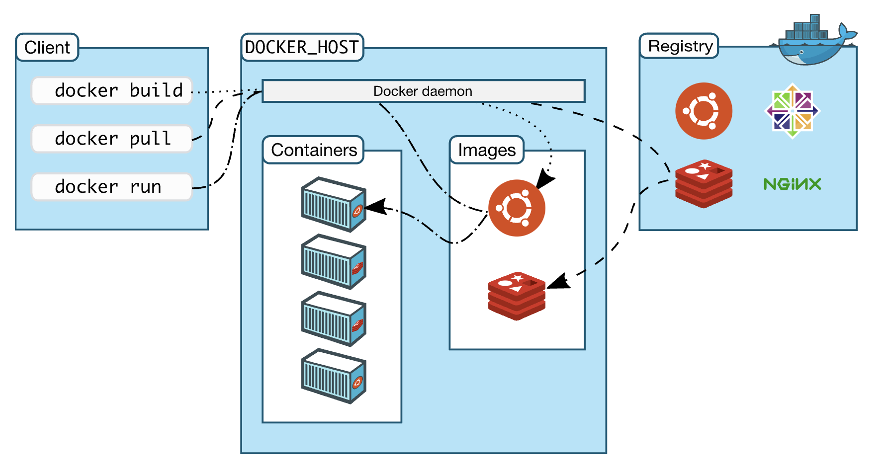
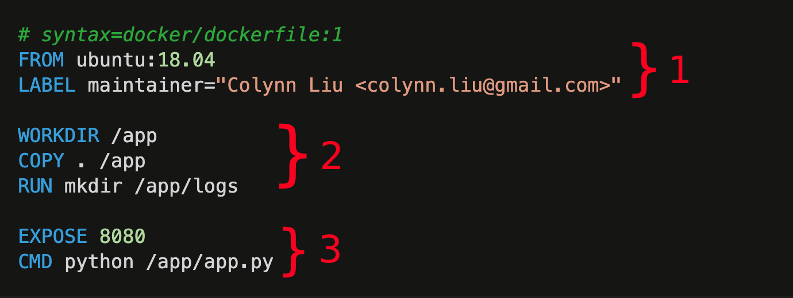

# Dockerfile详解
- [Dockerfile详解](#dockerfile详解)
  - [前置 - docker是什么](#前置---docker是什么)
  - [Dockerfile是什么](#dockerfile是什么)
    - [概述](#概述)
    - [如何使用](#如何使用)
  - [Dockerfile结构](#dockerfile结构)
    - [示例dockerfile](#示例dockerfile)
  - [Dockerfile语法格式](#dockerfile语法格式)
    - [.dockerignore file](#dockerignore-file)
  - [Dockerfile 常用命令](#dockerfile-常用命令)
    - [From/RUN](#fromrun)
      - [1. `FROM`](#1-from)
      - [](#)
      - [2. `RUN`](#2-run)
    - [WorkDir / COPY / ADD](#workdir--copy--add)
    - [ENV EXPOSE](#env-expose)
    - [ENTRYPOINT vs CMD](#entrypoint-vs-cmd)
    - [ARG](#arg)
    - [ONBUILD](#onbuild)
    - [Healthcheck  /  Volume](#healthcheck----volume)
  - [Dockerfile 最佳实践](#dockerfile-最佳实践)
  - [分阶段构建](#分阶段构建)
  - [自定义构建镜像](#自定义构建镜像)
  - [docker镜像的生成方式](#docker镜像的生成方式)
    - [概述](#概述-1)
    - [方式](#方式)
  - [彩蛋 - BuildKit](#彩蛋---buildkit)
## 前置 - docker是什么
* Docker是一套平台即服务（PaaS）产品，它使用操作系统级的虚拟化，以容器的形式来交付软件。

* Docker的主要好处是它允许用户将一个应用程序及其所有的依赖关系打包成一个标准化的单元(容器)，用于软件开发、交付。与虚拟机不同，主机上所有的容器都共享一个操作系统内核的服务，从而能够更有效地利用底层系统和资源。
  
* 容器之间相互隔离，它们可以通过明确定义的通道相互通信。
  



## Dockerfile是什么

### 概述


* Docker可以通过读取`Dockerfile`中的指令自动构建镜像。
* `Dockerfile`是一个文本文件，定义从一个镜像开始，它包含了用户可以在命令行上调用的所有命令，最后可以通过`docker build` 组装成一个镜像。
### 如何使用

* 一般情况下，`Dockerfile`会使用执行`docker build`命令的根目录下的`Dockerfile`, 当前你也可以使用`-f`指定`Dockerfile`的路径

```sh
# Dockerfile use current root path
$ docker build . 

# Dockerfile use -f flag to point.
$ docker build -f /path/to/a/Dockerfile .
```

* 构建镜像时指定镜像的tag
```sh
# image default use latest tag
$ docker build -t shykes/myapp .

# image use 1.0.2 tag
$ docker build -t shykes/myapp:1.0.2 .

# 当前你也可以同时指定多个镜像tag
$ docker build -t shykes/myapp:1.0.2 -t shykes/myapp:latest .
```

_注_: docker守护程序在`Dockerfile`中运行指令之前，会先执行一个初步验证，如果语法不正确将会返回错误，结束运行。

## Dockerfile结构

### 示例dockerfile

```dockerfile
# syntax=docker/dockerfile:1
FROM ubuntu:18.04
LABEL maintainer="Colynn Liu <colynn.liu@gmail.com>"

WORKDIR /app
COPY . /app
RUN mkdir /app/logs

EXPOSE 8080
CMD python /app/app.py
```
#



注解：
1. Dockerfile 头信息
2. Dockerfile 命令集合
3. Dockerfile 运行时声明

## Dockerfile语法格式

```Dockerfile
# Comment
INSTRUCTION arguments
```

* Dockerfile命令是不区别大小写的，而我们习惯性用大写，因为这样可以更好与参数区别。

* Docker会按照顺序运行Dockerfile内的指令。__`Dockerfile`必须以`FROM`指令开始__,当然`FROM`也是可以在[解析器指令](https://docs.docker.com/engine/reference/builder/#parser-directives)、注释或是全局范围的[ARG](https://docs.docker.com/engine/reference/builder/#arg)之后。

_注_: [解析器指令](https://docs.docker.com/engine/reference/builder/#parser-directives)是可选的（很少用到），目前仅有`syntax`/`escape` 这两个解析器指令的定义。


### .dockerignore file

当使用 `ADD` or `COPY` . 时，为了避免将不需要的大文件或是敏感文件拷贝进容器，可以使用 `.dockerignore` 来忽略它们。

1. 我们来看一个 `.dockerignore`的示例:

```sh
# comment
*/temp*    # eg: /somedir/temporary.txt
*/*/temp*  # eg: /somedir/subdir/temporary.txt
temp?      # eg: /tempa and /tempb
**/*.go    #
```


2. 更多

```sh
*.md
!README*.md
README-secret.md
```

##  Dockerfile 常用命令

### From/RUN
#### 1. `FROM`

```dockerfile
FROM [--platform=<platform>] <image> [AS <name>]
```

Or

```dockerfile
FROM [--platform=<platform>] <image>[:<tag>] [AS <name>]
```

Or

```dockerfile
FROM [--platform=<platform>] <image>[@<digest>] [AS <name>]
```

Tips:
* `ARG` is the only instruction that may precede FROM in the Dockerfile
* `FROM` can appear multiple times within a single Dockerfile to create multiple images
* Optionally a name can be given to a new build stage by adding `AS name` to the `FROM` instruction. The name can be used in subsequent `FROM` and `COPY --from=<name>` instructions to refer to the image built in this stage.
* The `tag` or `digest` values are optional. If you omit either of them, the builder assumes a `latest` tag by default. The builder returns an error if it cannot find the `tag` value.

#### 
An `ARG` declared before a `FROM` is outside of a build stage(在构建阶段之外), so it can’t be used in any instruction after a `FROM`. To use the default value of an ARG declared before the first `FROM` use an `ARG` instruction without a value inside of a build stage:

```dockerfile
ARG VERSION=latest
FROM busybox:$VERSION
ARG VERSION
RUN echo $VERSION > image_version
```
  
#### 2. `RUN`

`RUN` has 2 forms:

`RUN <command>` (shell form, the command is run in a shell, which by default is `/bin/sh -c` on Linux or `cmd /S /C` on Windows)
`RUN ["executable", "param1", "param2"]` (exec form)

_Notes_: 
1. The __exec form__ is parsed as a JSON array, which means that you must use double-quotes (`“`) around words not single-quotes (`‘`).
2. `RUN [ "echo", "$HOME" ]`与 `RUN [ "sh", "-c", "echo $HOME" ]` 有什么区别,一起来看下例子 [`./assets/dockerfile.run`](https://github.com/warm-native/docs/tree/master/docker/assets/dockerfile.run)
  

### WorkDir / COPY / ADD 

### ENV EXPOSE 

### ENTRYPOINT vs CMD 
    * CMD特点
    * 含义及区别


### ARG
The ARG instruction defines a variable that users can pass at build-time to the builder with the docker build command using the --build-arg <varname>=<value> flag. If a user specifies a build argument that was not defined in the Dockerfile, the build outputs a warning.

### ONBUILD

### Healthcheck  /  Volume

## Dockerfile 最佳实践
* https://docs.docker.com/develop/develop-images/dockerfile_best-practices/
  
  
Each instruction you create in your Dockerfile results in a new image layer being created. Each layer brings additional data that are not always part of the resulting image. For example, if you add a file in one layer, but remove it in another layer later, the final image’s size will include the added file size in a form of a special "whiteout" file although you removed it. In addition, every layer contains separate metadata that add up to the overall image size as well. 


## 分阶段构建
* https://docs.docker.com/develop/develop-images/multistage-build/


## 自定义构建镜像
* https://docs.docker.com/develop/develop-images/baseimages/


## docker镜像的生成方式
### 概述

我们所说的`Docker images` 实际上是由一个或是多个镜像层构建的。 镜像中的层是以父子关系连接在一起的，每个层代表最终容器图像的某些部分。
### 方式
  * 通过docker容器生成镜像
  * 通过dockerfile生成镜像；

## 彩蛋 - BuildKit